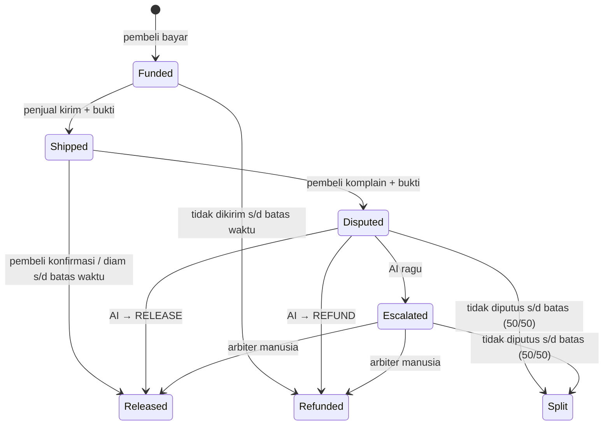
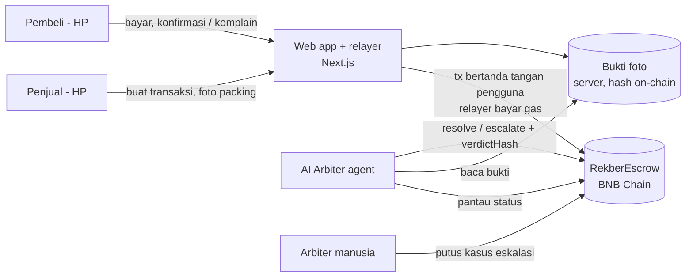

# Rekber AI — Blueprint Produk & Pitch

> **Satu kalimat:** *Rekber tanpa admin — uang dipegang smart contract, sengketa diputus AI.*
> **Event:** Indonesia Web3 Hackathon 2026 (Binance Academy × BNB Chain × Coinvestasi) · **Deadline submit: 7 Okt 2026** (diperpanjang; cek jam & zona waktu di Luma/Telegram)
> **Track:** AI Agents (utama) + Finance & Commerce + Consumer Apps (form mengizinkan multi-track)
> **Status:** pivot dari MANDOR pada 28 Sep 2026. Rencana teknis untuk eksekutor ada di [`PLAN.md`](PLAN.md).

Semua angka & fakta sudah dicek sumbernya pada 28 Sep 2026 — daftar lengkap + link di **§14 Sumber**. Tanda `[VERIFIKASI]` yang tersisa = belum bisa dipastikan; **jangan dipakai** di pitch/video sampai dicek.

---

## 1. Masalah

**Jual-beli online di luar marketplace itu rawan tipu, dan "solusinya" sendiri sering jadi penipuan.**

- Jutaan transaksi terjadi di grup Facebook, Instagram, WhatsApp, Kaskus, TikTok — HP bekas, akun game, tiket konser, barang koleksi. Di situ **tidak ada escrow** seperti di Shopee/Tokopedia.
- **Penipuan belanja/jual-beli online adalah modus scam nomor 1 di Indonesia** menurut Indonesia Anti-Scam Centre (IASC) OJK: 53.928 laporan (Nov 2024 – 15 Okt 2025), dari total ±299 ribu laporan scam dengan kerugian Rp7 triliun. Per 14 Jan 2026 total laporan IASC 432.637 dengan kerugian Rp9,1 triliun. *(§14 [1][2])*
- **"Pesan HP, yang datang batu bata"** benar-benar terjadi: Okt 2021 seorang pembeli HP Rp2,5 juta menerima kotak berisi batu — **toko dan kurir saling lempar kesalahan**. *(§14 [4])* Pelajaran: bahkan di marketplace yang punya escrow, **masalah sebenarnya adalah pembuktian siapa yang curang** (penjual atau kurir).
- Jalan keluar yang dipakai orang: **rekber (rekening bersama)** — pihak ketiga menahan uang sampai barang diterima. Tapi:
  1. **Rekber palsu** adalah modus yang terdokumentasi: penipu menawarkan barang murah lalu mengarahkan korban ke "rekber" yang ternyata komplotannya. Polda Bali (Mei 2026) mencatat modus rekber palsu marak di jual-beli akun game (Mobile Legends, Free Fire, Valorant). *(§14 [5][6])*
  2. Rekber digital resmi (mis. **RekberPay**) tetap **memegang uang di rekening mereka** dan sengketa dimediasi admin. *(§14 [7])*
  3. Rekber independen umumnya memungut ±1–5% dari nilai transaksi. *(§14 [8], sumber sekunder — sebut sebagai "umumnya", bukan angka pasti)*

**Inti masalah (first principles):** transaksi antar orang asing butuh **pihak yang memegang uang** dan **pihak yang menilai bukti**. Dua-duanya sekarang manusia/perusahaan yang harus dipercaya buta — dan tidak ada yang mengumpulkan **bukti yang cukup untuk menentukan siapa yang curang**.

## 2. Solusi

Rekber AI mengganti admin rekber dengan dua hal:
- **Smart contract di BNB Chain memegang uang** → tidak ada orang yang bisa membawanya kabur, termasuk kami.
- **AI agent menilai bukti** → foto packing vs foto unboxing vs janji penjual, diputus dalam hitungan detik, alasannya publik.

### Alur (6 langkah)
1. **Penjual** membuat transaksi: nama barang, harga, deskripsi, foto. **AI mengubah deskripsi jadi "janji penjual"** (checklist spesifikasi objektif, mis. "iPhone 13 · 128GB · hitam · tidak ada retak · dus + charger"). Penjual menandatangani penawaran itu secara digital (otomatis, tanpa ribet) — **harga & janji penjual tidak bisa diubah siapa pun, termasuk server kami**. Penjual dapat link `/d/RKB-7F3K9Q` untuk dibagikan di WhatsApp/IG.
2. **Pembeli** buka link, baca janji penjual, klik bayar → uang **terkunci di kontrak** (tanpa gas, tanpa install wallet).
3. **Penjual** memfoto **barangnya (bukan cuma dus)** di samping **kode transaksi** yang ditulis di kertas, lalu kirim + input resi. AI langsung mengecek foto packing dan memberi label ke pembeli (✅ sesuai / ⚠️ mencurigakan).
4. **Pembeli** terima barang → klik "Sesuai" → uang cair ke penjual (fee 1%). Diam sampai batas waktu → **otomatis cair** (penjual juga dilindungi).
5. **Ada masalah?** Pembeli upload foto unboxing + kode transaksi + keluhan. Penjual diberi waktu menanggapi.
6. **AI hakim** membandingkan janji penjual, foto packing, foto unboxing, dan tanggapan kedua pihak → **REFUND / RELEASE**, atau **ESKALASI ke arbiter manusia** kalau ragu. Keputusan + alasannya **dikomit on-chain (verdictHash)**.

### Aturan main (ditampilkan ke semua pengguna — ini yang membuat keputusan AI adil & bisa diprediksi)
1. **Beban bukti ada di penjual sebelum kirim:** foto packing wajib memperlihatkan **barangnya** + kode transaksi. Foto dus tertutup saja = bukti lemah.
2. **Pembeli wajib memfoto unboxing** dengan kode transaksi terlihat.
3. Bukti tanpa kode transaksi dianggap lemah (bisa foto lama/orang lain).
4. Bukti penjual kuat + bukti pembeli lemah → **RELEASE** (dana ke penjual).
5. Bukti pembeli kuat menunjukkan barang tidak sesuai + bukti penjual tidak membuktikan barang benar dikirim → **REFUND**.
6. Dua-duanya kuat tapi bertentangan (mis. kemungkinan tertukar di kurir) → **ESKALASI** ke manusia.
7. Operator hilang pun dana tidak nyangkut: sengketa yang tidak diputus sampai batas waktu → **dibagi 50/50 otomatis** oleh kontrak.

## 3. Kenapa blockchain? Kenapa AI? (jawaban wajib juri)

| Pertanyaan | Jawaban |
|---|---|
| Kenapa blockchain? | Masalah utamanya **pemegang uang yang bisa kabur**. Di Rekber AI, uang dipegang kontrak — kami sendiri tidak bisa mengambilnya. Relayer kami cuma membayar gas; tanpa tanda tangan pembeli/penjual dia tidak bisa berbuat apa-apa. Setiap keputusan tercatat publik di BscScan. Hapus blockchain → balik ke "percaya admin". |
| Kenapa AI? | Menilai bukti foto itu pekerjaan yang dulu butuh admin manusia 24 jam. AI membaca foto packing & unboxing, membandingkan dengan janji penjual, dan memutus dalam detik — dengan alasan tertulis. Hapus AI → balik ke admin manual yang lambat & mahal. |
| Kenapa AI agent, bukan cuma model? | Agent berjalan sendiri: memantau kontrak, mengumpulkan bukti, menunggu tanggapan penjual, memutus, **mengeksekusi pencairan on-chain dengan wallet-nya sendiri**, dan tahu kapan harus eskalasi. |

## 4. State machine kontrak

## 5. Arsitektur & trust model

| Pihak | Harus percaya ke | Mitigasi |
|---|---|---|
| Pembeli | Penjual mengirim barang | Uang terkunci; tidak dikirim → refund otomatis |
| Penjual | Pembeli tidak menahan konfirmasi | Pembeli diam → dana otomatis cair ke penjual |
| Keduanya | AI memutus dengan adil | Aturan main publik, confidence gate, eskalasi ke manusia, alasan + verdictHash on-chain |
| Keduanya | Operator (relayer/arbiter) | Relayer tidak bisa bertindak tanpa tanda tangan pengguna; arbiter hanya bisa memilih refund/release/eskalasi, **tidak bisa mengambil dana**; operator hilang → split 50/50 |
| Keduanya | Penyimpanan foto di server | Hanya hash di chain; foto tidak dipublikasikan on-chain. Roadmap: BNB Greenfield/IPFS |

## 6. Posisi vs kompetitor

**Di hackathon ini** (snapshot 28 Sep, 27 submission):
- **MileAI** — escrow milestone freelancer yang dicairkan AI dari bukti teks/link, satu pihak. → *Rekber AI menengahi sengketa **dua pihak** dari **foto**, dan menggantikan perilaku rekber yang sudah ada.*
- **E-Trace** — platform transparansi luas (marketplace, kas bersama, donasi). → *Rekber AI fokus pada satu masalah (sengketa jual-beli barang fisik) dan tidak memaksa orang pindah marketplace. Catatan: alur "share link" sendiri bukan pembeda — RekberPay juga memakainya (lihat tabel di bawah).*
- **OriginTag / Gachard** — keaslian barang (NFT paspor). → *Beda masalah: kami soal kepercayaan transaksi, bukan keaslian produk.*
- Tidak ada submission yang menyasar **rekber untuk social commerce**.

**Di luar hackathon:**

| Pemain | Apa | Bedanya dengan Rekber AI |
|---|---|---|
| Escrow Shopee/Tokopedia | Escrow di dalam marketplace | Hanya berlaku di platform mereka; kasus batu bata tetap berakhir "toko vs kurir saling lempar" *(§14 [4])* |
| **RekberPay** (Web2, Indonesia) | Rekber digital: buat transaksi → share link → bayar VA/QRIS → dana ditahan RekberPay → admin memediasi sengketa *(§14 [7])* | **Pesaing paling langsung.** Mereka *custodial* (uang di rekening mereka) dan sengketa diputus admin. Kami *non-custodial* (uang di kontrak, operator tidak bisa mengambil) dan sengketa diputus AI dalam detik dengan alasan publik. Kelebihan mereka yang harus diakui: sudah pakai rel rupiah resmi (VA/QRIS) |
| **GenLayer "Internet Court"** (Jul 2026, konsorsium 27 perusahaan termasuk OKX, MetaMask, ZKsync) | Pengadilan AI on-chain untuk sengketa transaksi, terutama **antar AI agent**; ±30 menit, ±$0,90 per kasus; bukti berupa hash/log/atestasi *(§14 [9])* | Validasi bahwa "AI sebagai hakim sengketa" itu kategori nyata. Mereka menyasar layanan digital & agent; kami menyasar **barang fisik antar manusia** dengan **bukti foto**, dalam hitungan detik, untuk pengguna awam Indonesia |
| Proyek hackathon "EscrowDispute" (GenLayer) | Juri AI YES/NO untuk deliverable vs spec *(§14 [10])* | Konsep mirip MileAI (penilaian hasil kerja); tidak ada protokol bukti foto dua pihak |
| Kleros | Arbitrase juri manusia on-chain | Lambat & mahal untuk transaksi Rp1–10 juta; kami AI dulu, manusia hanya saat ragu |

**Klaim orisinalitas yang jujur (pakai kalimat ini, jangan "pertama di dunia"):**
> *Escrow dengan AI sebagai hakim sudah mulai muncul secara global. Yang belum ada: **protokol bukti** untuk jual-beli barang fisik antar orang — penjual wajib memfoto barang bersama kode transaksi sebelum kirim, pembeli wajib memfoto unboxing dengan kode yang sama — sehingga AI bisa menentukan **siapa yang curang**, bukan cuma "sesuai atau tidak". Itu persis bagian yang gagal di kasus batu bata: toko dan kurir saling lempar karena tidak ada bukti.*

**Jawaban satu kalimat:**
- *"Bedanya dengan MileAI?"* → "MileAI menilai hasil kerja satu pihak; Rekber AI menengahi sengketa dua pihak dengan protokol bukti foto untuk barang fisik."
- *"Bedanya dengan RekberPay?"* → "RekberPay memegang uang Anda dan admin mereka yang memutus. Kami tidak bisa memegang uang Anda sama sekali, dan setiap putusan tercatat publik."

## 7. Model bisnis
- **Fee 1% hanya saat transaksi berhasil cair ke penjual.** Refund = gratis. Insentif kami selaras: kami untung hanya kalau jual-beli jujur selesai.
- Di ujung bawah kisaran rekber independen (umumnya ±1–5%, §14 [8]) dan bekerja 24 jam tanpa admin.
- Berikutnya: API/widget "Bayar via Rekber AI" untuk toko online kecil & grup jual-beli; paket untuk komunitas (admin grup FB dapat bagi hasil).

## 8. Regulasi & risiko (sebut terang-terangan di pitch)
1. **Kripto bukan alat pembayaran sah di Indonesia.** UU Mata Uang hanya mengakui rupiah sebagai alat pembayaran; stablecoin belum diakui sebagai alat bayar; aset kripto diawasi OJK sejak 10 Jan 2025 (POJK 27/2024). BI sendiri sedang menyiapkan stablecoin/rupiah digital. *(§14 [11][12])* → MVP memakai Mock IDRX di testnet. Jalur produksi: IDRX + on/off-ramp berizin, lalu kemitraan dengan penyelenggara jasa pembayaran (PJP) berizin atau sandbox inovasi OJK — kontrak & AI kami jadi *trust layer*-nya.
1b. **Menjalankan rekber itu sendiri kegiatan yang diatur.** Hukumonline menyebut UU No. 3/2011 tentang Transfer Dana dan menyarankan mengecek izin penyelenggara rekber di Bank Indonesia. *(§14 [6])* Argumen kami: kontrak non-custodial berarti operator tidak pernah menerima dana — tetapi **kepastian hukumnya belum ada**; sebut ini terang-terangan dan jawab dengan jalur mitra PJP.
1c. **IDRX asli di BNB Chain berbeda dari Mock kita:** 0 desimal dan **tidak mendukung `permit` (EIP-2612)** — dicek langsung ke kontraknya di BSC mainnet. *(§14 [13])* Pembayaran tanpa gas di demo memakai `permit` di Mock IDRX; jalur produksi untuk IDRX asli: sponsor gas `approve` lewat paymaster MegaFuel (BNB Chain) atau EIP-7702 (aktif di BSC sejak hardfork Pascal, Mar 2025). *(§14 [14][15])* Jangan klaim "IDRX asli sudah tanpa gas".
2. **"AI yang memutus uang orang?"** → AI hanya memutus kasus jelas (confidence ≥ 0.85), sisanya ke manusia; aturan main publik; alasan tercatat on-chain; malformed/ragu = eskalasi, tidak pernah auto-cair.
3. **Manipulasi bukti** → kode transaksi di setiap foto, deteksi foto dobel antar transaksi, instruksi di dalam foto/teks diabaikan (anti prompt injection).
4. **Cash-out ke rupiah** belum ada di MVP → roadmap on-ramp (jujur, jangan diklaim sudah ada).

## 9. Scope MVP — disiplin
**MUST:** kontrak RekberEscrow + test; transaksi end-to-end di BSC testnet (buat → bayar → kirim → konfirmasi/komplain → putusan AI → cair/refund); AI checklist, cek foto packing, AI hakim sengketa; tanpa gas untuk pengguna; halaman transaksi dengan timeline + link BscScan; layar panggung.
**NICE:** tanggapan penjual dengan foto; halaman arbiter manusia (MVP: skrip CLI); tombol share WhatsApp; identitas agent ERC-8004.
**JANGAN:** mainnet, token sendiri, marketplace/katalog, chat antar pengguna, login/KYC, integrasi API kurir (MVP: AI membaca foto resi), aplikasi native.

## 10. Skrip demo 3 menit (Demo Day)

| Waktu | Adegan |
|---|---|
| 0:00–0:20 | **Hook:** "Siapa di sini yang pernah beli barang di grup Facebook atau IG, dan deg-degan uangnya hilang?" → slide: "Penipuan belanja online = modus scam **nomor 1** di Indonesia — IASC OJK" + tangkapan berita batu bata 2021. |
| 0:20–0:45 | **Masalah:** di luar marketplace tidak ada escrow; orang pakai rekber, tapi rekber palsu adalah modus penipuan tersendiri, dan rekber resmi pun memegang uang Anda. Bahkan di marketplace, kasus batu bata berakhir "toko vs kurir saling lempar" — **tidak ada bukti siapa yang curang**. |
| 0:45–1:00 | **Solusi satu kalimat:** "Rekber tanpa admin — uang dipegang smart contract, sengketa diputus AI." |
| 1:00–1:30 | **Live:** teman "jualan iPhone 13" di HP → AI menulis janji penjual. Penonton scan QR → bayar tanpa gas → layar panggung: *Rp 8.500.000 terkunci* + link BscScan. |
| 1:30–1:50 | Penjual upload foto packing **hanya dus tertutup** → AI langsung memberi label ⚠️ "barang tidak terlihat di foto packing" ke pembeli. |
| 1:50–2:25 | Paket dibuka: **batu bata** 🧱 (properti panggung). Pembeli foto + kode → komplain. Penjual menjawab "sudah sesuai kok". Layar: AI menimbang → **REFUND**, alasan dalam Bahasa Indonesia, verdictHash di BscScan, uang kembali ke pembeli. |
| 2:25–2:45 | **Adil ke dua arah (kalau waktu cukup):** kasus kedua, pembeli bohong "lecet" padahal foto mulus → **RELEASE**. Satu kalimat: "AI tidak memihak pembeli — dia memihak bukti." |
| 2:45–3:00 | **Penutup:** "Kami tidak bisa membawa kabur uang Anda — bahkan kalau kami mau. Rekber AI." |

**Rencana cadangan (wajib):** video rekaman alur lengkap di testnet; 2 HP tim sudah login & bersaldo; hotspot sendiri; deal cadangan yang sudah di tahap "Shipped" supaya bisa lompat ke adegan sengketa.

## 11. Q&A juri

| Pertanyaan | Jawaban |
|---|---|
| Kalau AI salah? | AI hanya memutus kasus jelas; ragu → manusia. Aturan main publik & alasan on-chain, jadi kesalahan bisa diaudit. Roadmap: banding ke panel manusia. |
| Kalau penjual & pembeli kongkalikong / foto palsu? | Kode transaksi unik di setiap foto, deteksi foto dobel antar transaksi, bukti dikomit hash-nya on-chain sebelum putusan. |
| Kenapa tidak pakai Shopee saja? | Banyak transaksi terjadi di luar marketplace (grup FB, IG, WA, akun game, tiket) — di sana tidak ada escrow. Dan bahkan di marketplace, sengketa batu bata macet di "toko vs kurir" karena tidak ada protokol bukti. |
| Kenapa tidak pakai RekberPay? | RekberPay memegang uang Anda di rekening mereka dan adminnya yang memutus. Kami tidak bisa memegang uang Anda sama sekali, putusan dalam detik, dan setiap putusan tercatat publik. Kami akui: mereka sudah pakai rel rupiah resmi — itu jalur produksi kami juga (§8). |
| AI hakim kan sudah ada (GenLayer/Internet Court)? | Justru itu validasi: OKX & MetaMask ikut konsorsiumnya. Mereka fokus sengketa layanan digital antar AI agent; kami fokus barang fisik antar manusia dengan protokol bukti foto dan pengguna awam Indonesia. |
| Legal? | Lihat §8 — terang-terangan: stablecoin rupiah + on-ramp berizin + mitra PJP. |
| Kalau server kalian mati? | Kontrak tetap jalan: tidak dikirim → refund; diam → cair; sengketa tak diputus → 50/50. Tidak ada dana yang nyangkut selamanya. |
| Revenue? | 1% hanya dari transaksi yang berhasil. |
| Kenapa BNB Chain? | Blok ±0,75 detik sejak hardfork Maxwell (Jun 2025) → pembayaran terasa instan; EIP-7702 aktif sejak Pascal (Mar 2025) dan paymaster MegaFuel → jalur resmi untuk transaksi tanpa gas bagi pengguna awam; IDRX (stablecoin rupiah) sudah ada di BNB Chain. *(§14 [13][14][15][16])* |

## 12. Draf teks submission (English — form & README)

**Problem statement**
> Online shopping fraud is the #1 scam type reported to Indonesia's Anti-Scam Centre (IASC, OJK): 53,928 reports between Nov 2024 and Oct 2025, out of ~299,000 scam reports totalling Rp7 trillion in losses. Many person-to-person trades happen outside marketplaces — in Facebook groups, Instagram, WhatsApp and gaming communities — where there is no escrow. People rely on "rekber" (rekening bersama): a middleman who holds the money until the item arrives. But fake rekber is itself a documented scam, licensed rekber services still hold your money, and disputes are decided manually by an admin. Even inside marketplaces, the infamous "ordered a phone, received a brick" cases end with the shop and the courier blaming each other — because nobody collected evidence of who cheated.

**Solution**
> Rekber AI replaces the human middleman. The buyer's payment is locked in a BNB Chain smart contract that nobody — including us — can withdraw from. The seller must photograph the actual item next to a unique deal code before shipping. If the buyer is satisfied (or stays silent until the window closes), funds release to the seller. If not, an AI arbiter agent compares the seller's promised spec, the packing photo and the buyer's unboxing photo, then autonomously refunds or releases on-chain — or escalates to a human when unsure. Every verdict is committed on-chain as a hash of its reasoning. Users need no wallet setup and pay no gas.

**Project detail** → pakai isi README (arsitektur + mermaid §4–§5 + tabel trust model + link BscScan + cara menjalankan).

## 13. Roadmap (setelah hackathon)
IDRX asli + on/off-ramp berizin + mitra PJP · gas sponsorship untuk `approve` IDRX via MegaFuel / EIP-7702 · integrasi API pelacakan kurir (jendela konfirmasi mulai saat paket diterima, bukan saat dikirim) · klaim ke kurir saat bukti menunjukkan barang tertukar di jalan · banding ke panel arbiter manusia · reputasi penjual on-chain · bot WhatsApp · penyimpanan bukti di BNB Greenfield · identitas agent ERC-8004.

## 14. Sumber (dicek 28 Sep 2026)

| # | Klaim | Sumber |
|---|---|---|
| [1] | Penipuan belanja online = modus scam #1; 53.928 laporan (Nov 2024–15 Okt 2025); total ±299 ribu laporan, kerugian Rp7 T | Databoks/Katadata, data IASC, 21 Okt 2025 — https://databoks.katadata.co.id/en/finance/statistics/68f74ef7e7454/online-shopping-fraud-the-most-common-scam-in-indonesia |
| [2] | 432.637 laporan, kerugian Rp9,1 T per 14 Jan 2026 (disampaikan Friderica Widyasari Dewi, OJK, dalam rapat dengan DPR) | EmitenNews, 25 Jan 2026 — https://www.emitennews.com/news/catatan-ojk-rp91-triliun-hilang-akibat-scam-rp432m-bisa-diselamatkan · siaran pers OJK — https://ojk.go.id/id/berita-dan-kegiatan/siaran-pers/Pages/IASC-Berhasil-Kembalikan-Rp161-Miliar-Dana-Masyarakat-Korban-Scam.aspx |
| [3] | Laporan penipuan online ke Patroli Siber Polri: 10.583 kasus Jan–Mar 2026 | Pusiknas/Patroli Siber — https://patrolisiber.id/statistic (angka via ringkasan pencarian; **cek halaman aslinya sebelum dipakai**) |
| [4] | Pembeli HP Rp2,5 juta menerima kotak berisi batu; toko & kurir saling menyalahkan (Okt 2021) | Liputan6, 27 Okt 2021 — https://www.liputan6.com/hot/read/4694788/beli-hp-rp-25-juta-di-online-shop-wanita-ini-malah-dapat-kotak-berisi-batu · kasus serupa (sepeda → batu bata, Nov 2021): https://jatimtimes.com/baca/254660/20211122/194500/pesan-sepeda-via-online-yang-datang-malah-batu-bata |
| [5] | Modus rekber palsu di jual-beli akun game (Ditressiber Polda Bali), 14.496 kasus penipuan online s/d Mei 2026 | Metrotoday, 19 Mei 2026 — https://www.metrotoday.id/nasional/2026/05/19/modus-penipuan-jual-beli-akun-game-online-marak-kerugian-capai-triliunan-rupiah/ |
| [6] | Cara kerja rekber, modus rekber palsu, dasar hukum (KUHP 378, UU ITE 28(1), UU 3/2011 Transfer Dana), saran cek izin BI | Hukumonline, 1 Agu 2022 — https://www.hukumonline.com/klinik/a/tips-jika-menjadi-korban-penipuan-rekber-lt62e7a5e9aad1a/ |
| [7] | RekberPay: share link, bayar VA/QRIS, dana ditahan RekberPay, admin memediasi sengketa, fee persentase dengan batas minimum | https://rekberpay.com/?lang=en |
| [8] | Fee rekber independen umumnya ±1–5% | Liputan6 (artikel panduan, sumber sekunder) — https://www.liputan6.com/feeds/read/5909479/rekber-adalah-panduan-lengkap-sistem-pembayaran-online-yang-aman |
| [9] | GenLayer Internet Court (10 Jul 2026, 27 anggota termasuk OKX, MetaMask, ZKsync); ±30 menit, ±$0,90 per putusan | CryptoDaily, Jul 2026 — https://cryptodaily.co.uk/2026/07/genlayer-ai-agent-court-defi-dispute-resolution · https://metamask.io/news/genlayer-internet-court-ai-agent-jury |
| [10] | EscrowDispute (proyek hackathon GenLayer): juri AI untuk deliverable vs spec | https://github.com/Toblex6/EscrowDispute |
| [11] | Kripto dilarang sebagai alat bayar (UU Mata Uang); stablecoin belum diakui sebagai alat bayar; pengawasan kripto pindah ke OJK 10 Jan 2025 (POJK 27/2024) | Lightspark, 22 Agu 2025 — https://www.lightspark.com/knowledge/is-crypto-legal-in-indonesia (sumber sekunder — untuk pitch sebut "UU Mata Uang", cek pasalnya sendiri kalau mau menyebut nomor pasal) |
| [12] | BI menyiapkan stablecoin berbasis rupiah digital (Project Garuda) | https://coinvestasi.com/berita/bank-indonesia-rencana-terbitkan-stablecoin · https://www.idnfinancials.com/news/58561/bank-indonesia-develops-stablecoin-based-on-digital-rupiah |
| [13] | IDRX di BNB Chain: `0x649a2DA7B28E0D54c13D5eFf95d3A660652742cC`, **0 desimal**, **tanpa `permit`** | Dokumentasi IDRX — https://docs.idrx.co/introduction/supported-chain-and-contract-address + dicek langsung via `eth_call` ke BSC mainnet: `decimals()` = 0, `DOMAIN_SEPARATOR()` & `nonces()` revert |
| [14] | MegaFuel: paymaster BNB Chain untuk sponsor gas wallet EOA (BEP-414) | https://docs.bnbchain.org/bnb-smart-chain/developers/paymaster/overview/ · https://docs.nodereal.io/docs/megafuel-overview |
| [15] | EIP-7702 aktif di BSC sejak hardfork Pascal (20 Mar 2025) | https://www.bnbchain.org/en/blog/bnb-chain-announces-pascal-hard-fork |
| [16] | Blok BSC ±0,75 detik sejak hardfork Maxwell (30 Jun 2025) | https://www.bnbchain.org/en/blog/bnb-chain-announces-maxwell-hardfork-bsc-moves-to-0-75-second-block-times |
